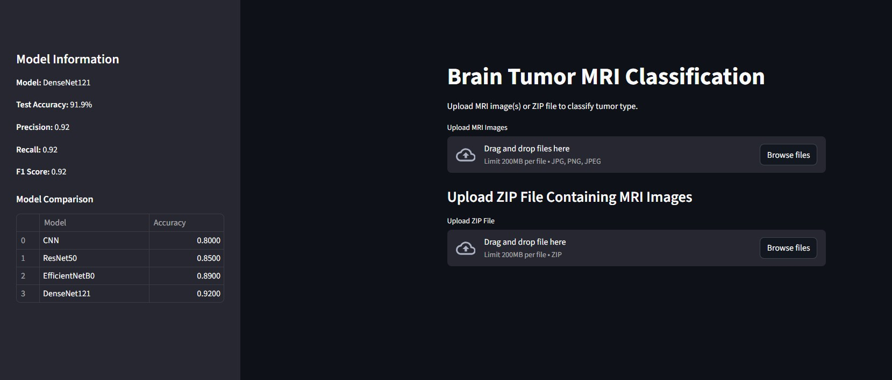
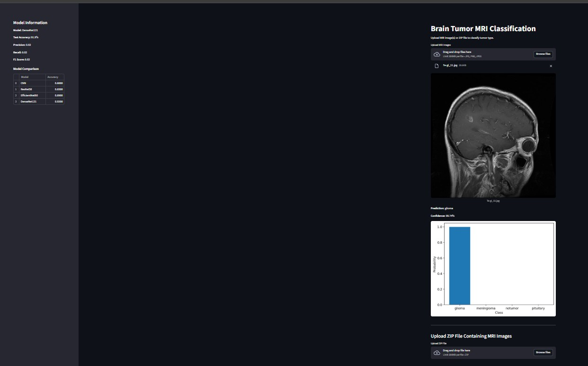
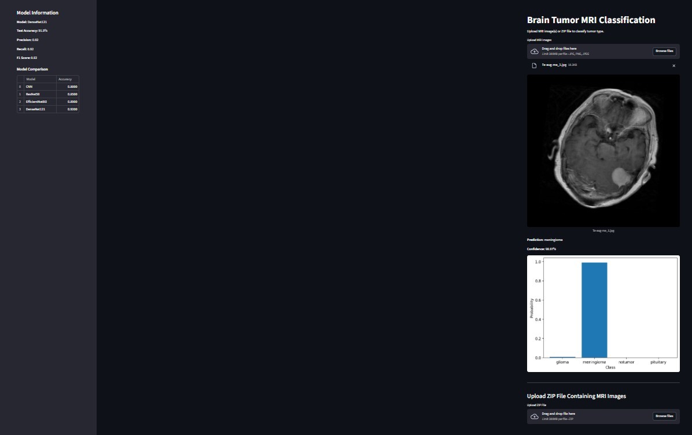
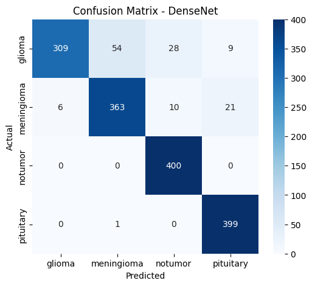
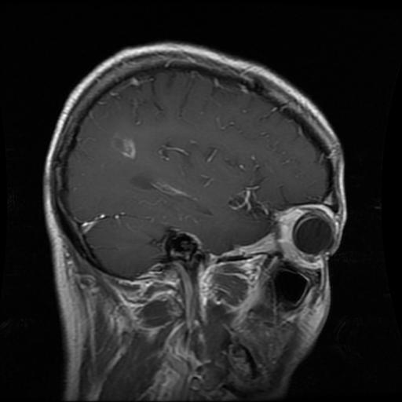
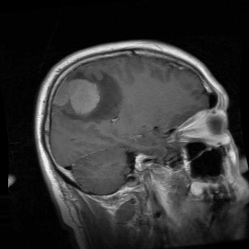
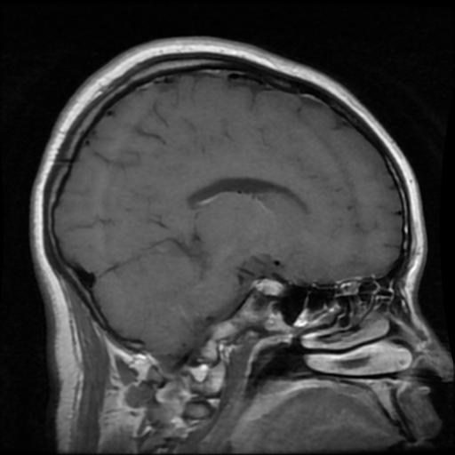
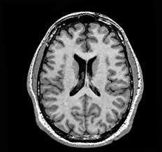

# Brain Tumor MRI Classification using Deep Learning and Streamlit Deployment

## Overview
This project presents a deep learning-based system for classification of brain tumors from MRI images. Multiple convolutional neural network architectures were implemented and compared, including a custom CNN, ResNet50, EfficientNetB0, and DenseNet121. The best-performing model was deployed as an interactive web application using Streamlit.

The application allows users to upload single MRI images, multiple images, or a ZIP folder containing MRI images for automated tumor classification and probability visualization.

This project demonstrates an end-to-end machine learning pipeline including data preprocessing, model training, evaluation, comparison, and deployment.

---

## Dataset
The dataset used in this project is the Brain Tumor MRI Dataset available on Kaggle.
The dataset contains MRI images categorized into four classes:
- Glioma Tumor
- Meningioma Tumor
- Pituitary Tumor
- No Tumor

Images were resized, normalized, and used for training deep learning models.

---

## Deep Learning Models Implemented
The following models were trained and evaluated:

| Model | Description |
|------|-------------|
| Custom CNN | Baseline convolutional neural network |
| ResNet50 | Transfer learning using residual networks |
| EfficientNetB0 | EfficientNet architecture |
| DenseNet121 | Dense convolutional network |

---

## Model Performance Comparison

| Model          | Accuracy | Precision | Recall | F1 Score |
|---------------|---------|-----------|--------|----------|
| CNN            | 0.80     | 0.81      | 0.80   | 0.79     |
| ResNet50       | 0.85     | 0.86      | 0.85   | 0.85     |
| EfficientNetB0 | 0.89     | 0.89      | 0.89   | 0.89     |
| DenseNet121    | **0.92** | **0.92**  | **0.92** | **0.92** |

DenseNet121 achieved the best performance and was selected for deployment.

---

## Evaluation Metrics
Models were evaluated using:
- Accuracy
- Precision
- Recall
- F1 Score
- Confusion Matrix
- ROC Curve

**DenseNet121 Performance:**
- Accuracy: 91.9%
- Precision: 0.92
- Recall: 0.92
- F1 Score: 0.92

---

## Streamlit Web Application
The deployed Streamlit application allows users to:
- Upload a single MRI image
- Upload multiple MRI images
- Upload a ZIP folder containing MRI images
- View tumor classification results
- View prediction confidence scores
- View prediction probability distribution
- View model performance information in sidebar

---

## Application Screenshots
### Streamlit Application Interface






### Confusion Matrix


---

## Sample MRI Images
The repository includes sample MRI images for each tumor class that can be used to test the application.

### Glioma


### Meningioma


### Pituitary


### No Tumor


---

## Project Structure

Finaldeployment/
│
├── app.py
├── requirements.txt
├── README.md
├── .gitignore
│
├── images/
│ ├── App_screenshot_1.jpg
│ ├── App_screenshot2.jpg
│ ├── App_screenshot_3.jpg
│ └── Confusion_matrix.png
│
├── models/
│ ├── densenet_model.pkl
│ └── class_names.pkl
│
├── notebooks/
│ └── brain-tumor-mri-classification.ipynb
│
└── sample_images/
├── glioma/
├── meningioma/
├── notumor/
└── pituitary/

--------

## Installation and Running the Application

### Clone the repository
```bash
git clone https://github.com/yourusername/brain-tumor-mri-classification.git
cd brain-tumor-mri-classification

### Install dependencies
pip install -r requirements.txt

### Run the Streamlit application
Run the Streamlit application

## Open the application in your browser:
http://localhost:8501

## Workflow
MRI Dataset
→ Image Preprocessing
→ Train CNN Models
→ Transfer Learning (ResNet, EfficientNet, DenseNet)
→ Model Evaluation
→ Model Comparison
→ Save Best Model
→ Streamlit Deployment
→ User Upload → Prediction

------------------

## Project Scope and Intended Use

This project is developed as a research and educational prototype to demonstrate the application of deep learning techniques for brain tumor MRI image classification and model deployment using a web application.

This system is not intended for clinical or diagnostic use. The results produced by this model should not be used for medical decision-making.

The primary purpose of this project is to demonstrate:

Deep learning model development
Transfer learning for medical imaging
Model evaluation and comparison
Deployment of machine learning models using Streamlit
End-to-end machine learning workflow

----------------------
## Future Improvements
Grad-CAM visualization for explainable AI
Tumor segmentation using U-Net
K-Fold cross-validation
Cloud deployment
Integration with medical imaging systems
Dataset Citation

## Reference
Masoud Nickparvar, Brain Tumor MRI Dataset, Kaggle.
https://www.kaggle.com/datasets/masoudnickparvar/brain-tumor-mri-dataset


--------------------------------------
Author
Kiran Kumar
Computational Biology | Bioinformatics | Machine Learning | Deep Learning

License
This project is intended for research and educational purposes.